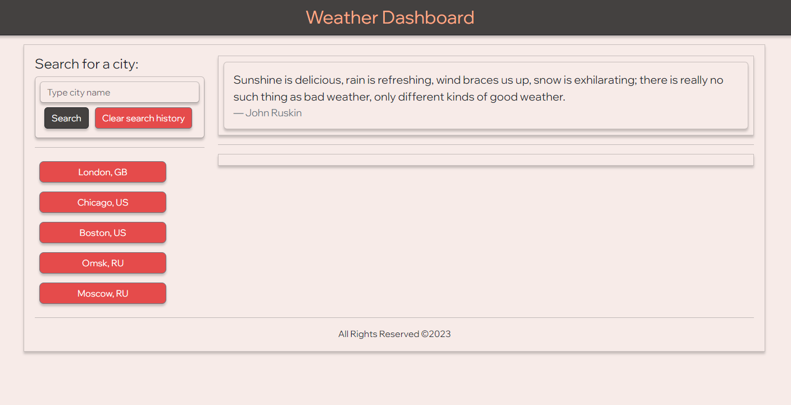
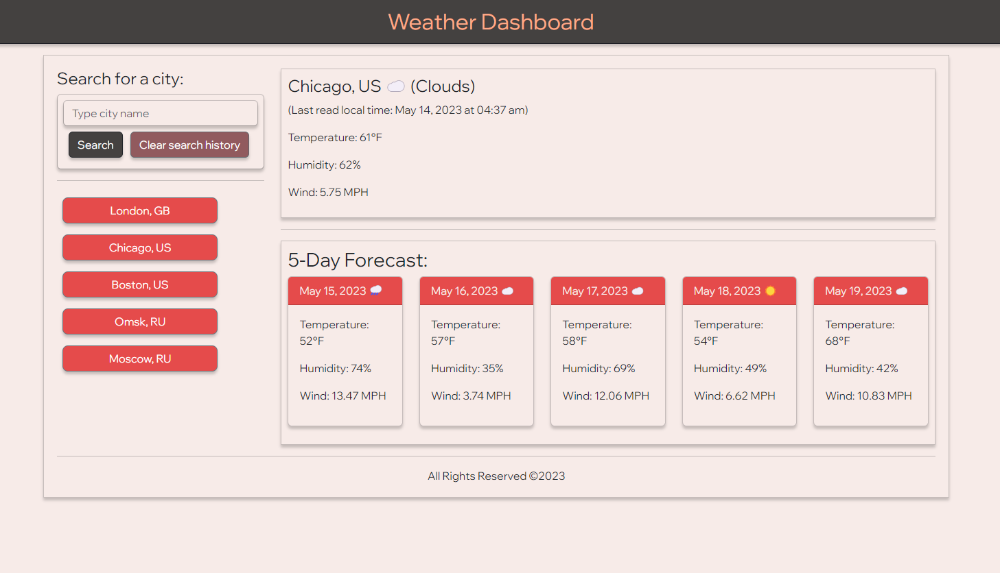

# Weather Dashboard

## Description

The goal of this project was to retrieve and display weather forecast using Open Weather API. This web application runs in the browser and features dynamically updated HTML and CSS powered by jQuery.

- When user opens the weather dashboard, they can enter a city name and press Search button to see today's and 5-day forecast weather for that city. 
- When user views weather for that city, they can see city name with country code, the date, an icon representation of weather conditions, the temperature, the humidity, and the wind speed.
- User can also see search history on the left hand side.
- When they click on the city from search history, weather and 5-day forecast for that city displayed again.
- User has an option to clear Search history.
- If use reloads the page, search history persists. 

## Usage

Web application is located at: https://vlada-caban.github.io/weather-dashboard/

Screenshot of the homepage with previous search history pulled from the local browser:

Individual weather forecast example: 

## Credits

- Bootstrap was used for styling.
- Day.js library was used for date manipulations.
- Open Weather API (https://openweathermap.org/api) was used for weather forecast.
- Color palette generated by Coolors (https://coolors.co/)

## License

Please refer to the LICENSE in the repo.